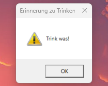

# Drink Reminder aka "Trink was!"

> Windows application, which shows a pop-up every 30 minutes, reminding you to drink something.

## Project Status

This is a hacky two-hour project created for a Windows friend by a Linux user.

## Development

I installed the .NET 8 SDK on Windows 11.

Clone this repo and run `dotnet build`

## Deployment

I just ran `dotnet publish` and copied the resulting `.exe` into the user's autostart directory. The console is hidden on startup, leaving only

## License

`GNU GPLv3`, except for the `ConsoleExtension` class, which is `CC BY-SA 4.0`
